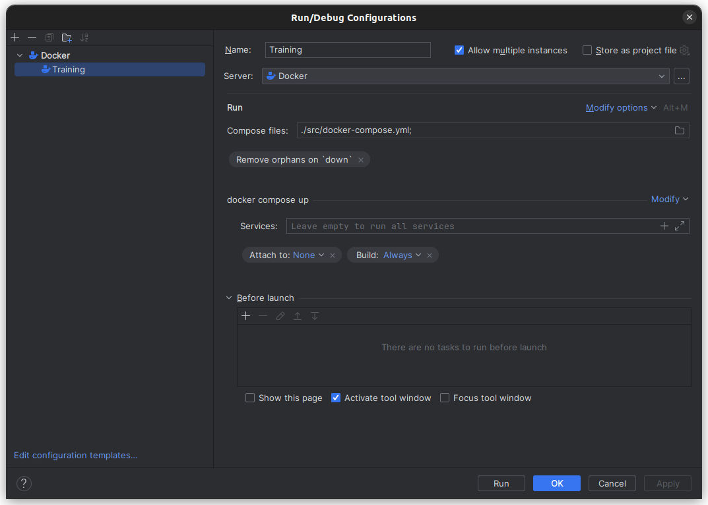

# Django + Aiogram + PSQL

Приветствую на трейнинге, посвященный языку программирования - **Python**!

#### Здесь ты научишься:
- Правильно строить свое **Web-приложение**
- Настраивать связи между **моделями**
- Изучишь основы **SQL-диалекта**
- Сможешь написать простого **Telegram-бота** с интеграцией в **Django**

По сути, это трейнинг дает базовое и просто представление. Ты можешь дополнить или реализовать свои идеи так, как ты хочешь. Но не забывай про базовые правила написания кода :)

# Установка

#### 1. CMD:
```bash
$ git clone git@github.com:Famper/preview-django-traning.git
```

#### 2. Настройка запуска через `docker-compose.yml`:


#### 3. Холостой запуск:
Запустите `docker-compose.yml`. В первый раз будет ошибка в Django контейнере. Так как по умолчанию в настройках `pg_hba.conf` подключение по локальной сети запрещено.

#### 4. Исправление `pg_hba.conf`:

- Действия выполняются из корневой директории: `preview-django-traning/`

```bash
$ sudo nano python-data/pgdata/pg_hba.conf
```

- В конец файла вставьте эту строку:

```conf
host    all             all             0.0.0.0/0               md5
```

- Нажмите сочетание клавиш `CTRL + S`

#### 5. Заново запустите `docker-compose.yml` и радуйтесь!


### ПРИМЕЧАНИЕ: ВСЕ ЗАДАЧИ НАХОДЯТСЯ В ПАПКЕ `lessons/`

