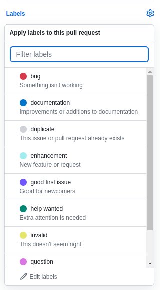

# Обязательные правила работы с GITHUB

- Для каждого задания создаете **новую ветку**
> **По типу:** `shot_lesson_name/author`
> 
> **Пример:** `lesson_1.0/ivan`

- Для каждой новой ветки создаете **Pull Request**
> Имя **Pull Request** должно соответствовать ветке
> 
> Описание **Pull Request** должно быть взято из описания самого задания. То есть, полностью копируете описание и вставляете его в **Pull Request**

- При выполнении задания нужно обязательно сказать об этом куратору
> Куратор должен обязательно проверить Ваше задание. Если все хорошо, он сделает - Merge ветки в `main` или `master`.
> 
> > #### Самостоятельно сливать ветку не надо

- Обязательно ставьте `Labels` в **Pull Request**

> 
>
> Они будут изменены на более понятные, по типу: `В процессе`, `Есть доработки` или `Готово`

- При слитии ветки в главную нужно обновиться
> Когда сливается Ваша новая ветка в основную - Вам нужно обязательно обновить свою главную. Чтобы все новые изменения были применены.
> 
> А уже после Вы на основе обновленной главной ветки - создаете новую для следующего задания